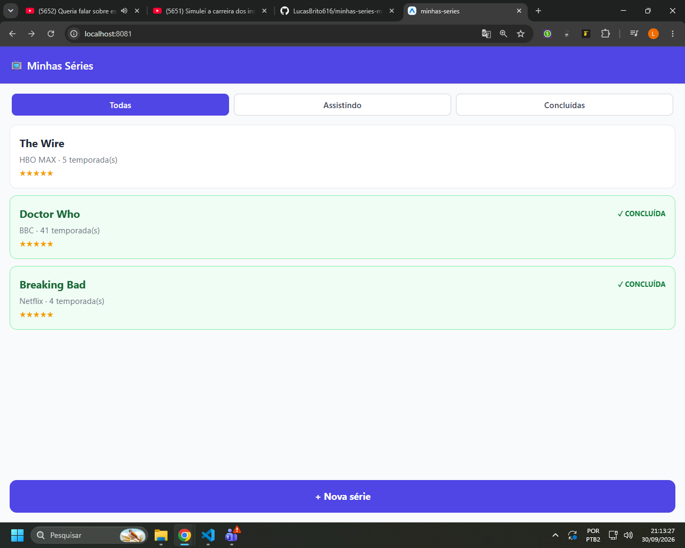
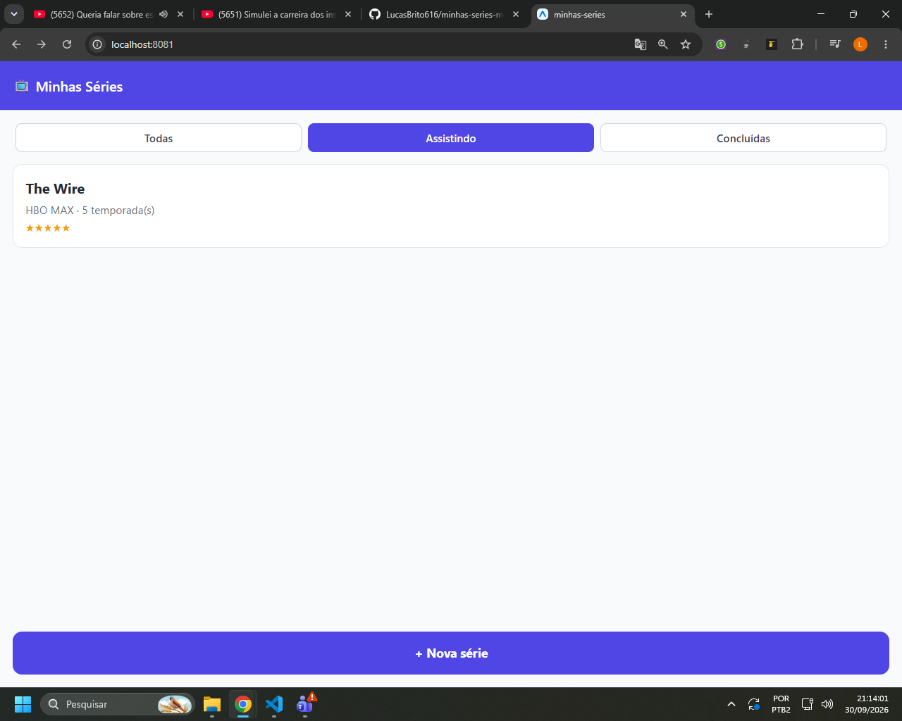
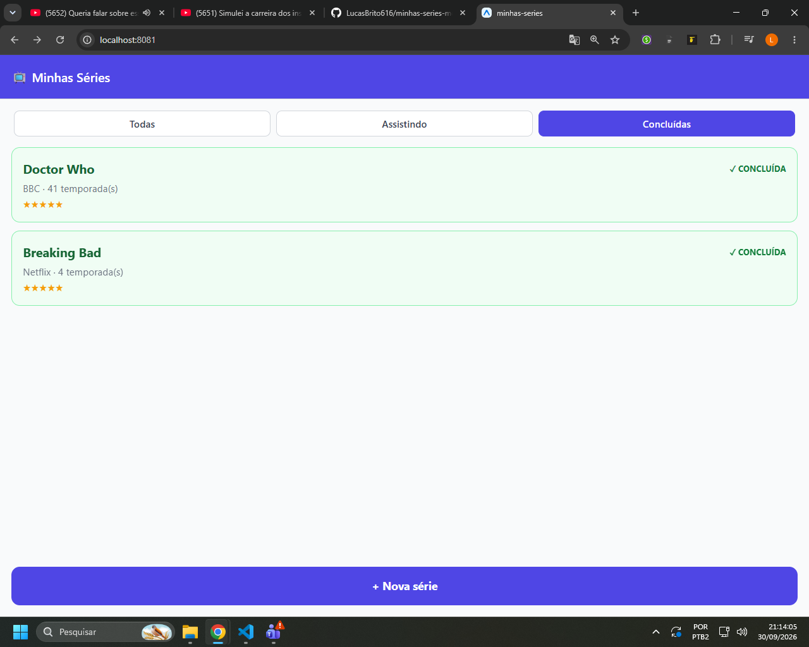
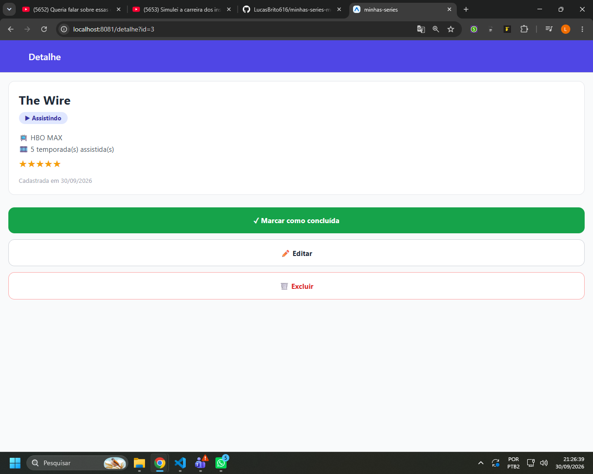

# Minhas Séries

App mobile feito com React Native + Expo para registrar as séries que estou assistindo ou já concluí. Os dados ficam salvos em SQLite e continuam lá depois de fechar o app.

**Tecnologias:** Expo, Expo Router, NativeWind 4, expo-sqlite, TypeScript e Repository Pattern.

## Como rodar

```
npm install
npx expo start
```

> O Expo Go não abriu no meu celular, então desenvolvi e testei no navegador (tecla `w`). Para o SQLite funcionar na web, o `metro.config.js` tem uma configuração extra (suporte a `.wasm` e cabeçalhos de segurança).

## Teste de persistência (Etapa 8)

Cadastrei 3 séries, concluí duas e editei uma. Depois fechei a aba do navegador e abri `localhost:8081` de novo. Os prints abaixo são de depois de reabrir: os dados continuaram lá e os filtros funcionam.

**Todas:**



**Assistindo:**



**Concluídas:**



**Detalhe:**



## Diário do copiloto

Usei a IA (Claude) nesse projeto para ajuda de código e revisão de estrutura, Fui sempre conferi o código com o enunciado e com as aulas e anotei abaixo o que aprendi e o que precisei corrigir ou adaptar.

### Registro 1 — Etapa 1
**O que eu pedi:** ajuda porque o Expo Go não abria o app no celular.
**O que a IA sugeriu (resumo):** rodar pelo navegador, instalando o `react-native-web` e adicionando ao `metro.config.js` o suporte a arquivos `.wasm` e os cabeçalhos COOP/COEP, que o expo-sqlite precisa na web.
**O que eu fiz:** aceitei. No navegador o SQLite roda como WebAssembly, e essas configurações não afetam o celular.

### Registro 2 — Etapa 4
**O que eu pedi:** como fazer o filtro de concluídas.
**O que a IA sugeriu (resumo):** resolver no SQL com `WHERE concluida = ?`, passando 0 ou 1.
**O que eu fiz:** aceitei e não segui o repositório de referência, que filtra com `.filter()` no JavaScript. O enunciado exige o filtro no SQL, e assim o banco só devolve o que a tela precisa.

### Registro 3 — Etapa 4
**O que eu pedi:** como devolver a série criada no `createSerie`.
**O que a IA sugeriu (resumo):** buscar pelo `result.lastInsertRowId` e lançar um erro se a série não for encontrada.
**O que eu fiz:** aceitei. O repositório de referência usa `!`, que só "promete" ao TypeScript que o valor existe; com o `throw`, se algo der errado, aparece um erro claro.

### Registro 4 — Etapa 5
**O que eu pedi:** como fazer a lista atualizar ao voltar do formulário.
**O que a IA sugeriu (resumo):** usar `useFocusEffect` com `useCallback`.
**O que eu fiz:** aceitei. O `useEffect` com `[]` só roda quando a tela é montada, e a lista não é montada de novo ao voltar, porque fica embaixo na pilha. O `useCallback` evita que a função seja recriada a cada render e o efeito rode em loop; com `[filtro]`, a lista recarrega quando o filtro muda.

### Registro 5 — Etapas 6 e 7
**O que eu pedi:** a validação do formulário e a confirmação de exclusão.
**O que a IA sugeriu (resumo):** mostrar o erro de validação num `<Text>` e, na exclusão, usar `window.confirm` quando `Platform.OS === 'web'`.
**O que eu fiz:** adaptei o enunciado. O `Alert.alert` do React Native não aparece no navegador, então mantive o `Alert.alert` para o celular e usei o `confirm` do navegador na web.


### Registro 6 — Etapa 8
**O que eu pedi:** explicação para o erro "Cannot manually set color scheme, as dark mode is type 'media'" ao abrir o app no navegador.
**O que a IA sugeriu (resumo):** a configuração do `tailwind.config.js` que ela tinha passado não tinha `darkMode`; a correção foi adicionar `darkMode: 'class'`.
**O que eu fiz:** corrigi. O NativeWind por padrão segue o tema do sistema e o Expo Router tenta definir o tema manualmente. Depois de mudar, reiniciei com `-c` para limpar o cache.

### Registro 7 — Etapa 8
**O que eu pedi:** como fazer o teste de persistência.
**O que a IA sugeriu (resumo):** trocar o navegador do VS Code pelo Chrome no meio do teste.
**O que eu fiz:** corrigi. Os dois navegadores não compartilham os dados, então as séries não apareceram no Chrome. Refiz o teste inteiro só no Chrome.